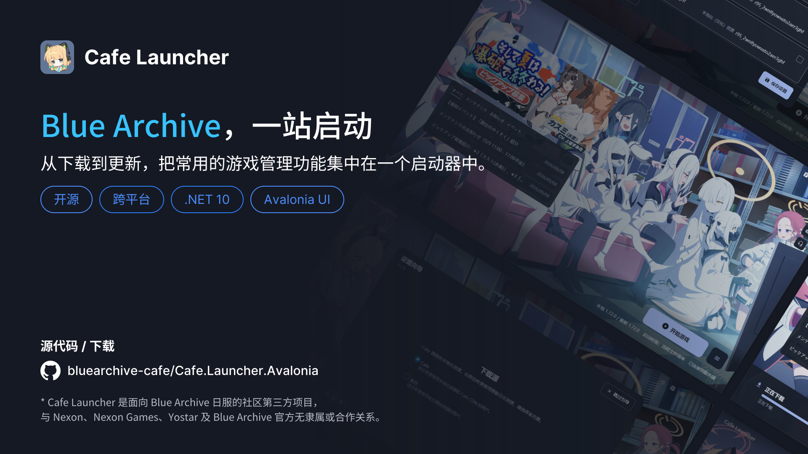

# Cafe Launcher

面向 Blue Archive 日服的社区第三方桌面启动器。基于 .NET 10 与 Avalonia 构建，把安装、更新、修复、启动和卸载集中在一个窗口里，并直接兼容官方启动器已经下载好的游戏目录。

[](https://github.com/bluearchive-cafe/Cafe.Launcher.Avalonia)
[](https://github.com/bluearchive-cafe/Cafe.Launcher.Avalonia/releases/latest)
[](https://github.com/bluearchive-cafe/Cafe.Launcher.Avalonia/releases)
[](https://github.com/bluearchive-cafe/Cafe.Launcher.Avalonia/releases/latest)<br/>
[](https://github.com/bluearchive-cafe/Cafe.Launcher.Avalonia/actions/workflows/build.yml)


[](https://github.com/bluearchive-cafe/Cafe.Launcher.Avalonia/search?l=c%23)
[](./LICENSE)
[](#平台支持与发行包)

[下载](https://github.com/bluearchive-cafe/Cafe.Launcher.Avalonia/releases) · [安装与首次使用](https://docs.bluearchive.cafe/cafe-launcher/installation) · [常见问题](https://docs.bluearchive.cafe/cafe-launcher/faq) · [反馈指南](https://docs.bluearchive.cafe/cafe-launcher/feedback) · [开发者指南](#开发者指南)

> [!IMPORTANT]
> Cafe Launcher 是社区维护的第三方项目，与 Nexon、Nexon Games、Yostar 及 Blue Archive 官方无隶属或合作关系。使用前请阅读[隐私政策](./PRIVACY.md)。



## 目录

- [Cafe Launcher](#cafe-launcher)
  - [目录](#目录)
  - [启动器能做什么](#启动器能做什么)
  - [平台支持与发行包](#平台支持与发行包)
  - [快速开始](#快速开始)
  - [与官方启动器的区别](#与官方启动器的区别)
  - [Linux 支持（实验性）](#linux-支持实验性)
    - [配置兼容运行环境](#配置兼容运行环境)
    - [启动器在 Linux 上额外做的事](#启动器在-linux-上额外做的事)
    - [已验证的组合与边界](#已验证的组合与边界)
  - [壁纸来源](#壁纸来源)
    - [内置默认壁纸](#内置默认壁纸)
    - [远程壁纸](#远程壁纸)
    - [自定义壁纸](#自定义壁纸)
  - [帮助与反馈](#帮助与反馈)
  - [开发者指南](#开发者指南)
    - [环境要求](#环境要求)
    - [构建与运行](#构建与运行)
    - [常用命令](#常用命令)
    - [代码结构](#代码结构)
    - [架构要点](#架构要点)
    - [测试](#测试)
    - [参与贡献](#参与贡献)
  - [本地数据与许可](#本地数据与许可)
  - [致谢](#致谢)

## 启动器能做什么

Cafe Launcher 既能接管官方启动器已经下载好的游戏目录，也能从零下载并管理游戏文件。它提供可暂停、可续传的下载任务、多种下载源与启动校验选项，并支持多语言界面、主题定制和本地诊断。

- **游戏管理：** 安装、增量更新、修复、启动和卸载；可继续使用官方启动器下载的游戏目录，两者的清单与配置文件互相兼容。
- **下载控制：** 最多 10 个并发传输、断点续传、暂停与继续、速度限制，以及下载完成后的 CRC64 校验。
- **启动校验：** 可在本地清单、远程清单和跳过检查三种验证模式之间选择，行为与官方启动器对齐。
- **桌面体验：** English、简体中文、繁體中文和日本語界面；支持系统、浅色和深色主题，以及背景与主题色定制。
- **本地化资源与诊断：** 通过 UID 管理 Cafe 下载源提供的本地化资源；查看或导出日志以协助排查问题。
- **启动器更新：** Windows 可直接在应用内更新（下载后经发布附带的 `SHA256SUMS` 校验再应用）；macOS 与 Linux 转到发布页。

设置、下载任务状态和日志都保存在本地。启动器不会修改游戏进程，也不会向游戏注入代码。

## 平台支持与发行包

| 平台 | 支持状态 | 发行包 |
| --- | --- | --- |
| Windows 10 1809+ / Windows 11，x64 | 正式支持 | 安装程序（推荐）、便携 ZIP |
| macOS，Apple Silicon | 实验性；暂不支持启动游戏 | `.app` 压缩包 |
| Linux，x64 | 实验性 | `.deb`、`.rpm`、AppImage、`.tar.gz` |

发行包已包含 .NET Runtime，无需另行安装。

macOS 版本目前可用于安装、更新和修复游戏，暂不提供启动游戏所需的兼容运行层。Linux 版可通过 Wine、UMU 或 Proton 启动游戏，详细说明见 [Linux 支持（实验性）](#linux-支持实验性)。

「测试版」指预发布版本；日常使用建议从发布页选择最新的正式版。macOS 与 Linux 尚未完成与 Windows 同等程度的适配和测试，请留意对应版本的发布说明。

## 快速开始

1. 打开[发布页](https://github.com/bluearchive-cafe/Cafe.Launcher.Avalonia/releases)，下载与你的平台匹配的安装包。Windows 用户通常选择安装程序；需要免安装时选择便携 ZIP。
2. 启动 Cafe Launcher，按首次设置向导选择界面语言、下载源、游戏目录和代理方式。
3. 如果已经安装游戏，选择现有的 `BlueArchive_JP` 目录；如果尚未安装，选择安装位置并从主界面开始安装。
4. 后续可在主界面更新或启动游戏，也可在设置中修复或卸载。

完整步骤见[安装与首次使用](https://docs.bluearchive.cafe/cafe-launcher/installation)。设置、[游戏操作](https://docs.bluearchive.cafe/cafe-launcher/operations)、[资源面板](https://docs.bluearchive.cafe/cafe-launcher/resource-panel)和[卸载与数据](https://docs.bluearchive.cafe/cafe-launcher/uninstall)指南也可在文档站查看。

## 与官方启动器的区别

Cafe Launcher 与官方启动器**共用同一个游戏目录与清单格式**，安装协议、下载校验方式保持对齐，可以在两者之间来回切换而不必重下游戏。差异集中在操作方式与周边能力上。下表依据[对官方启动器 v1.7.2 的静态对比研究](./docs/research/official-launcher-v1.7.2-comparison.md)整理——该结论针对特定历史版本，官方现行版本的行为可能已不同。

| 方面 | 官方启动器（v1.7.2） | Cafe Launcher |
| --- | --- | --- |
| 游戏运行中 | 安装阶段用 `taskkill /F /T` 强杀游戏目录内的同名进程后继续覆盖文件 | 拒绝写入并说明原因，绝不代用户结束游戏；写入前二次检查，能识别反作弊等占目录的相关进程 |
| 下载控制 | 任务写入浏览器 `localStorage`，重启后自动重进；无会话级暂停 | 暂停/继续、速度限制、退出后恢复，区分「用户停止」与「进程退出」 |
| 卸载范围 | 删除清单文件与状态文件 | 默认范围相近（另删桌面快捷方式）；可选「彻底清除」安装目录与受管兼容前缀，保留用户自定义 Prefix |
| 本地化资源 | 未见对应能力 | 通过 UID 管理 Cafe 下载源提供的汉化资源（独有功能） |
| 诊断与隐私 | 本地日志 + 按远端开关的云端日志上报 + AIHelp 客服 | 只留本地：日志查看/导出、崩溃报告，无任何远程遥测 |
| 界面语言 | 日服包固定日语 | English / 简体中文 / 繁體中文 / 日本語 |
| 平台 | Windows | Windows 正式支持；macOS 与 Linux 实验性（见下） |

官方有而 Cafe 未实现的部分也如实列出：`clickCode` 文件搬运、自更新时的游戏目录暂移/恢复、AIHelp 客服入口。若需要「原位替换官方安装程序」，这几项请先阅读对比研究文档中的边界说明。

## Linux 支持（实验性）

Linux 版除了安装、更新、修复游戏外，还可以通过兼容运行环境**启动游戏**。整条链路（包括 XIGNCODE3 反作弊）已在下面列出的组合上实机验证过，但只有这一个组合，请据此设定预期。

### 配置兼容运行环境

在「设置 → 游戏 → 兼容运行环境」中选择启动方式：

| 设置项 | 说明 |
| --- | --- |
| 运行环境 | 「自动」优先尝试 UMU，也可显式选择「UMU / Proton」或「Wine」；不选「Windows（原生）」即可走兼容层 |
| 运行器路径 | 留空自动检测 `umu-run` / `wine`，也可手动指定可执行文件 |
| Proton 路径 | 自定义 UMU 使用的 Proton 构建，留空由 UMU 自动选择 |
| Prefix 路径 | 留空由启动器按运行器管理相互隔离的 Prefix，也可指定自建 Prefix |

### 启动器在 Linux 上额外做的事

- **启动前环境预检**：检查 Prefix 位置是否可写、所在挂载点是否禁用执行（`noexec`）、文件系统是否支持符号链接，命中阻断级问题时就地说明原因与改法（例如把前缀移到 ext4 上）；发行版与大小写敏感性只记录、不据此拒绝。
- **运行中保护**：按启动器写入的所有权标记识别由它启动的游戏（标记会经 UMU/pressure-vessel 透传到整个进程族，启动器退出后依然有效），同时识别由官方启动器、桌面脚本等其他入口启动、仍占用安装目录的进程。
- **UID 自动读取**：资源面板可在配置的兼容前缀中找到游戏 Cookie 并读出 UID，不必手动填写。
- **更全的诊断信息**：导出内容包含运行器进程快照与输出（stdout/stderr）、GPU 与 Vulkan 探测、桌面会话类型、前缀元数据、本机已安装的 Proton 构建清单，反馈问题时不必手动收集。
- **单实例与系统代理**：同一登录会话内只允许一个实例，二次启动唤起已有窗口；代理「系统」档读取 GNOME 的系统代理设置。

### 已验证的组合与边界

2026-09-22 在 **Arch Linux + UMU 1.4.4 + UMU-Proton 10.0-4 + NTFS3 游戏目录**（Debug 构建）上验证了首次启动、登录、进入游戏、退出与再次启动，XignCode 反作弊未拦截。详见 [Linux 实机验证记录](./docs/design/linux-p0a-verification-2026-09-22.md)。

其他发行版、Proton 构建、显卡驱动组合**尚未验证**，不保证可玩；反作弊兼容性受这些因素影响，相关组件大版本更新后建议重新验证一次启动链路。

## 壁纸来源

启动器窗口背景由「设置 → 外观 → 背景」决定，共有三种来源，各自的图片出处如下。

### 内置默认壁纸

默认壁纸裁剪自 Pixiv 画师 **めるき（Meruki）** 的插画 **[初めてのゲーム](https://www.pixiv.net/artworks/142932674)**（作品 ID `142932674`）。

- 随应用打包的文件是 `src/Cafe.Launcher.Avalonia/Assets/launcher-background.png`（2560 × 1388），由原图居中裁剪并转为 PNG 后得到。
- 原图与裁剪后的源素材一并存档在 [`docs/assets/art-sources/`](./docs/assets/art-sources/)，不参与应用打包：`142932674_p0.jpg` 为原始插画（2970 × 1610），`142932674_p0_cut.jpg` 为裁剪版本（2560 × 1388）。
- 出处同时写在应用内的「设置 → 关于 → 法律信息」中，其中的「查看原始作品」会打开[该作品在 Pixiv 的页面](https://www.pixiv.net/artworks/142932674)。

**插画版权归原作者 めるき（Meruki）所有。** 该图片仅作为启动器背景使用，不随本项目源代码的 MIT 许可证授权，也不得被单独提取用于其他用途。如需在其他场合使用，请自行联系原作者取得许可。

### 远程壁纸

选择「远程」时，启动器从游戏官方接口返回的启动器配置里读取背景图地址（`LauncherBackgroundImg`）及其 CRC64 校验值，下载后缓存到本地数据目录，并按窗口尺寸解码显示。该图片由 Yostar 官方接口提供，版权归其权利人所有，本项目不随发行包分发，也不对其内容负责。

下载失败或接口未返回背景图配置时，启动器会回退到内置默认壁纸。

### 自定义壁纸

选择「自定义」后，可以指定本机的一张图片，或指定一个文件夹（每次刷新时从中随机挑选一张）。支持 `.png`、`.jpg`、`.jpeg`、`.bmp` 和 `.webp`。这类图片完全来自用户本机，版权与使用许可由用户自行负责，本项目不收集、不上传，也不分发。

此外，仓库顶部的[主视觉图](./docs/assets/key-visual.webp)与本项目各版本的发布横幅均为本项目自行制作的宣传物料，含有启动器界面的截图。

## 帮助与反馈

遇到问题时，先查看[常见问题](https://docs.bluearchive.cafe/cafe-launcher/faq)，再按[反馈指南](https://docs.bluearchive.cafe/cafe-launcher/feedback)准备启动器版本、复现步骤和必要的截图或诊断日志。

可先搜索[已有 Issues](https://github.com/bluearchive-cafe/Cafe.Launcher.Avalonia/issues)；如果仓库暂时不允许新建 Issue，或问题不适合公开，可通过反馈指南中的邮箱联系项目组。日志可能包含本地路径等环境信息，分享前请自行检查。

## 开发者指南

本仓库是启动器的完整源代码，包含 Avalonia 桌面应用、Windows 自更新 helper，以及单元测试与 Headless UI 测试两个测试项目。

| 项目 | 说明 |
| --- | --- |
| [`src/Cafe.Launcher.Avalonia`](./src/Cafe.Launcher.Avalonia/) | 桌面应用主体 |
| [`src/Cafe.Launcher.Updater`](./src/Cafe.Launcher.Updater/) | Windows 自更新 helper（单文件，复制到临时目录后应用更新） |
| [`tests/Cafe.Launcher.Avalonia.Tests`](./tests/Cafe.Launcher.Avalonia.Tests/) | xUnit v3 单元测试 |
| [`tests/Cafe.Launcher.Avalonia.HeadlessTests`](./tests/Cafe.Launcher.Avalonia.HeadlessTests/) | Avalonia Headless UI 测试，含金标截图基线 |

### 环境要求

- .NET SDK `10.0.302`（见 `global.json`，允许在同一功能带内滚动到较新的 SDK）。
- 仓库脚本使用 PowerShell 7（`pwsh`）；Windows PowerShell 5.1 不受支持，因为脚本使用了其解析器不接受的 `??`。
- 构建启用可空引用类型、编译绑定、代码风格检查与「警告视为错误」。一次成功的构建应当没有任何警告。

### 构建与运行

在 `pwsh` 中从仓库根目录执行：

```powershell
.\build.ps1
dotnet run --project .\src\Cafe.Launcher.Avalonia\Cafe.Launcher.Avalonia.csproj
```

### 常用命令

| 命令 | 用途 |
| --- | --- |
| `.\test.ps1` | 运行单元测试和 Headless UI 测试 |
| `.\test.ps1 -Suite Unit` / `-Suite Headless` | 只运行一个测试套件（`All`/`Unit`/`Headless`） |
| `.\test.ps1 -Filter "FullyQualifiedName~VersionComparerTests"` | 只运行过滤出的子集 |
| `.\dev.ps1 ui` | 运行 UI 样式契约和 Headless UI 检查 |
| `.\coverage.ps1` | 运行覆盖率门禁 |
| `.\verify.ps1` | 完整流程：Debug 构建、覆盖率、Release 构建 |
| `.\scripts\Test-LocalizationContract.ps1` | 检查多语言资源键和格式占位符 |
| `.\scripts\Build-Distribution.ps1` | 发布并打包自包含发行包 |
| `.\scripts\New-WindowsInstaller.ps1` | 从 `artifacts/publish/win-x64` 构建 Inno Setup 安装程序 |

运行单个测试类：

```powershell
dotnet test .\tests\Cafe.Launcher.Avalonia.Tests\Cafe.Launcher.Avalonia.Tests.csproj --filter "FullyQualifiedName~VersionComparerTests"
```

提交代码前请运行 `.\verify.ps1`。金标截图基线通过 `.\test.ps1 -UpdateGolden` 重新生成。

### 代码结构

```text
src/Cafe.Launcher.Avalonia/
├── Composition/       # 依赖注入组合根
├── Features/          # Shell、游戏操作、设置、向导、诊断和资源面板
├── Services/          # 网络、下载、清单、设置、本地化和日志
├── Models/            # 设置、API、清单和运行状态模型
├── ViewModels/        # 主窗口级 ViewModel 与模态契约
├── Views/             # Avalonia 视图和样式
├── Helpers/           # 路径校验、图片解码、目录遍历等共用工具
├── Resources/         # 多语言资源（.resx）
└── Assets/            # 图标、字体、音频和内置壁纸

src/Cafe.Launcher.Updater/  # Windows 自更新 helper
tests/
├── Cafe.Launcher.Avalonia.Tests/          # xUnit 单元测试
├── Cafe.Launcher.Avalonia.HeadlessTests/  # Avalonia Headless UI 测试
└── Support/                               # 两个套件共用的测试设施
```

### 架构要点

- `Composition/ServiceConfiguration.cs` 是唯一的依赖注入组合根，所有服务与 ViewModel 都在此注册，且全部为单例（单窗口桌面应用）。
- `Features/` 按功能垂直组织；功能之间不引用彼此的具体类型，需要协作时把窄接口提取到 `Services/` 并在组合根绑定。`Features/Shell` 是窗口外壳层，聚合各功能的呈现 ViewModel，是这条规则的既定例外。
- `Services/RemoteHttpTransport` 是唯一对外请求模块，统一负责代理、SSRF 校验、重定向、超时与重试；`Services/HttpClientFactory` 负责共享连接池与代理感知的租约，不要在别处新建 `HttpClient`。
- 游戏文件操作必须经过 `Helpers/GamePathValidator`，确保始终落在规范化的 `YostarGames\BlueArchive_JP` 目录内。
- 启动器数据根由组合根解析一次后注入各模块，不通过静态属性在运行期解析，便于测试隔离。
- `settings.json` 只通过 `ISavedSettingsWriter` 写入，其余模块一律经 `LauncherSettingsService` 读取。
- 界面文本必须同时补齐 `Resources/LauncherStrings.resx` 及其 `zh-Hans`、`zh-Hant`、`ja` 对应文件，并按字母序排列。

更完整的边界与约定见 [`AGENTS.md`](./AGENTS.md)、[`PROJECT_CONVENTIONS.md`](./PROJECT_CONVENTIONS.md)、[`CONTEXT.md`](./CONTEXT.md) 和 [`UBIQUITOUS_LANGUAGE.md`](./UBIQUITOUS_LANGUAGE.md)；设计决策记录见 [`docs/design/adr/`](./docs/design/adr/)。

### 测试

- 测试使用 xUnit v3；UI 测试使用 `Avalonia.Headless.XUnit`。
- 测试命名遵循 `Method_State_ExpectedResult`；针对源码或资源的契约测试可用两段式 `Subject_Expectation`。
- 不引入 mock 框架；优先使用手写的 `HttpMessageHandler` 子类、fake 和 stub，共用的存放在 `tests/TestDoubles/`。
- 平台限定的测试用 `Assert.SkipUnless` / `Assert.SkipWhen` 显式跳过，而不是提前 `return`。
- 改动 XAML 或样式后运行 `UiStyleContractTests`，较大改动运行 `.\dev.ps1 ui`。

### 参与贡献

- 提交问题前搜索已有 [Issues](https://github.com/bluearchive-cafe/Cafe.Launcher.Avalonia/issues)，并说明版本、运行平台和复现步骤。
- 提交信息遵循 [Conventional Commits](https://www.conventionalcommits.org/)，例如 `fix(settings): 修复切换语言后法律信息不显示`。
- 保持每个提交聚焦。涉及可见 UI 的改动请附截图；新增界面文本时同步维护所有语言资源。
- 改动架构或开发流程时，请在同一次改动中更新 `AGENTS.md`。

## 本地数据与许可

Windows 默认将设置、下载状态和日志保存在 `%LOCALAPPDATA%\Cafe Launcher\`。游戏安装目录中的清单与配置文件用于记录安装状态，并与官方启动器兼容。卸载启动器默认不会删除游戏文件；数据清理说明见[卸载与数据](https://docs.bluearchive.cafe/cafe-launcher/uninstall)。

项目源代码基于 [MIT License](./LICENSE) 发布。发行包中的第三方组件及其许可见 [THIRD-PARTY-NOTICES.md](./THIRD-PARTY-NOTICES.md)。

内置默认壁纸的版权归画师 めるき（Meruki）所有，不在 MIT 许可证的授权范围内，详见[壁纸来源](#壁纸来源)。

## 致谢

- 默认壁纸来自 Pixiv 画师 [めるき（Meruki）](https://www.pixiv.net/users/15737611) 的插画 [初めてのゲーム](https://www.pixiv.net/artworks/142932674)，感谢作者创作了这幅作品。插画版权归原作者所有，本项目仅在启动器中将其用作背景，不主张任何权利。
- 感谢 [Avalonia](https://avaloniaui.net/) 提供的跨平台 UI 框架，以及 [Material.Icons.Avalonia](https://github.com/SKProCH/Material.Icons.Avalonia)、[CommunityToolkit.Mvvm](https://github.com/CommunityToolkit/dotnet) 等开源项目。
- 感谢所有提交问题、反馈和参与测试的社区成员。
