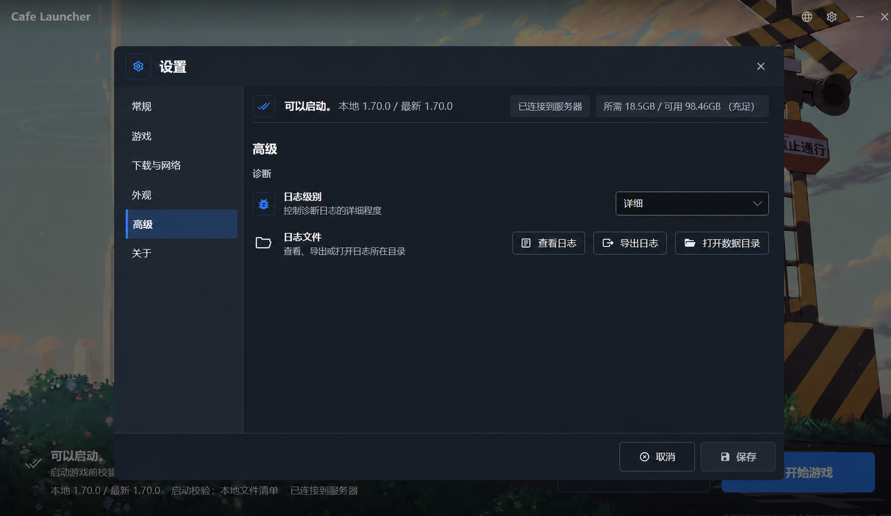

# 高级设置页布局一致性设计

## 目标

修复高级设置页中日志操作按钮缺少明确归属、与设置行基线不一致的问题，同时让该页面继续遵循常规、游戏、下载与网络等设置分类已经采用的布局语言。

用户进入高级设置后，应当能立即理解：日志级别控制诊断记录的详细程度；日志文件相关按钮用于查看、导出或打开日志目录。两组操作在视觉和语义上相互独立，但共同属于“诊断”分组。

## 视觉基准

最终确认稿：

可视化稿用于确认信息层级、分组关系和对齐方向。实际实现必须以仓库现有设计令牌、控件样式和 Headless 布局结果为准，不从图片反推新的颜色、尺寸或字体。

## 已选方案

采用与其他设置页相同的两行 `SettingRow` 结构：

1. 保留设置内容顶部的启动状态摘要，不改变所有分类共享的页面框架。
2. 保留“高级”页面标题和“诊断”分组标题。
3. 第一行继续显示“日志级别”、说明文字和右侧 `ComboBox`。
4. 新增第二个语义设置行“日志文件”，说明其包含查看、导出和定位日志文件的操作。
5. 将“查看日志”“导出日志”“打开数据目录”三个现有按钮放入第二行的右侧操作区。
6. 两行使用现有 `SettingRow` 的图标列、文本列和操作列；不增加卡片、背景层、行边框或分隔线。

## 与现有设置页的一致性

- 继续使用 `StackPanel.settings-group`，保持当前 `16px` 分组顶部间距。
- 两行均复用 `Controls/SettingRow.axaml`，不创建高级页专属行控件，也不修改共享控件的列定义。
- 日志文件操作区使用受限宽度的 `WrapPanel`，通过 `LauncherSpacingSm` 保持按钮和换行间距；按钮本身继续复用游戏管理行的样式。
- 按钮继续使用 `flat-action` 和 `button-content`，图标继续使用 `LauncherIconSm`。
- 日志级别选择框继续使用 `setting-control`，保持 `220px` 最小宽度和 `LauncherControlHeightSetting` 高度。
- 不新增表面色、边框、阴影、圆角或原始间距值。

## 布局与响应行为

- 两个设置行共享相同的图标左边界、标题左边界和右侧操作边界。
- 在默认 `1300×754` 和最小 `1024×640` 窗口尺寸下，日志级别选择框和日志操作区保持统一右边界；三个按钮按本地化文本长度在操作区内保持单行或自然换行，并始终正尺寸、无重叠且位于滚动内容区内。
- 保持设置对话框现有固定最大尺寸，分类切换时不改变窗口高度。
- 页面剩余空白是低密度分类在稳定对话框中的自然结果，不通过无关内容、卡片或装饰元素填充。
- 若本地化文本增长，按钮保留内容所需宽度，并在 `LauncherSettingRowActionMaxWidth` 限制内换行；布局测试负责防止操作区侵入标题说明区域。

## 文案与本地化

新增两项界面文案，并同步到 `Assets/Locales/` 的四种语言文件：

- `logFiles`：设置行标题，对应简体中文“日志文件”。
- `logFilesDescription`：说明该行用于查看、导出或打开日志所在目录。

现有 `viewLog`、`exportLogs` 和 `openDataDirectory` 文案与命令绑定保持不变。新增键通过 `LocalizedStrings` 暴露，且四种语言必须保持键集合一致。

## 交互与数据流

- 日志级别继续双向绑定 `Settings.Editor.Current.LogLevel`，并参与现有设置脏状态和保存流程。
- “查看日志”继续执行 `LogViewer.OpenCommand`。
- “导出日志”继续执行 `LogViewer.ExportCommand`。
- “打开数据目录”继续执行 `WindowChrome.OpenDataDirectoryCommand`。
- 日志文件操作是即时命令，不改变设置脏状态，也不启用“保存”按钮。
- 不新增 ViewModel 状态、服务、依赖或错误处理路径。

## 可访问性

- 新的日志文件行使用可见标题和说明，避免三个按钮成为缺少上下文的孤立操作。
- 三个按钮保留现有 `AutomationProperties.Name`、键盘焦点顺序和全局焦点环。
- Tab 顺序为日志级别选择框、查看日志、导出日志、打开数据目录，然后进入对话框底部操作区。
- 不使用颜色或图标作为唯一语义来源；标题、说明和按钮文字均保持可见。

## 实现范围

允许修改：

- `Views/SettingsAdvancedSection.axaml`
- `Assets/Locales/en.json`
- `Assets/Locales/ja.json`
- `Assets/Locales/zh-Hans.json`
- `Assets/Locales/zh-Hant.json`
- `Services/LocalizationService.cs`
- 与该布局和本地化行为直接相关的契约及 Headless 测试

明确不修改：

- `MainWindowSettingsOverlay` 的状态摘要、对话框框架、导航或底部操作区
- 共享 `SettingRow` 控件及其他设置分类
- 日志命令、设置保存逻辑、主题令牌或窗口尺寸

## 验证

- 样式或 XAML 契约测试确认高级页包含两个 `SettingRow`，三个日志按钮均位于“日志文件”行的操作区，不再存在行外 `WrapPanel`。
- 契约测试锁定三个按钮的命令、样式类和无障碍名称。
- Headless 测试在 `1300×754` 和 `1024×640` 下验证两个设置行的文本列与操作列对齐，控件无重叠、未裁切并位于窗口内。
- 本地化契约测试确认四种语言包含相同的新键且格式占位符一致。
- 运行 `./scripts/Test-LocalizationContract.ps1`、`./dev.ps1 ui` 和 `git diff --check`。
